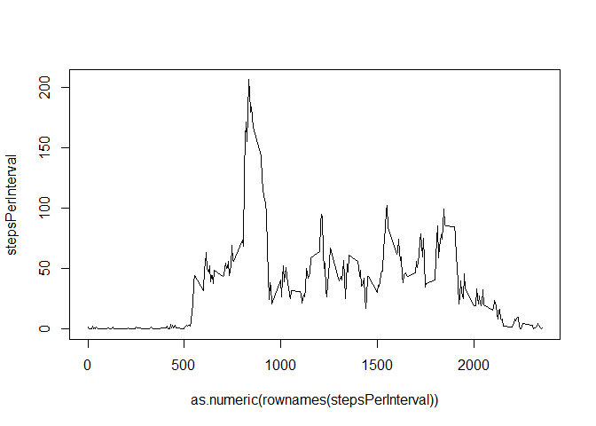
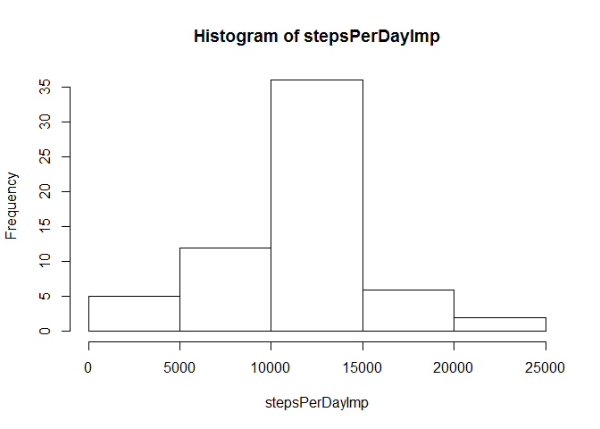
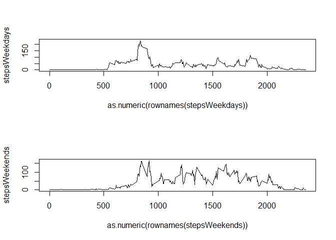

# Reproducible Research: Peer Assessment 1


## Loading and preprocessing the data


```r
# 1. Load the data
df <- read.csv("activity.csv")
# 2. Process/transform the data (if necessary)

## Create df with only complete cases (no NAs)
dfComplete <- df[complete.cases(df$steps),]
```

## What is mean total number of steps taken per day?


```r
# 1. Calculate the total number of steps taken per day
sum(dfComplete$steps)
```

```
## [1] 570608
```

```r
# 2. Make a histogram of the total number of steps taken each day
## Create array with steps per day
stepsPerDay <- tapply(df$steps,df$date,sum)
hist(stepsPerDay)
```

 

```r
# 3. Calculate and report the mean and median of the total number of steps taken per day
meanPerDay <- mean(stepsPerDay, na.rm=T)
medianPerDay <- median(stepsPerDay, na.rm=T)
```
## What is the average daily activity pattern?


```r
# 1. Make a time series plot (i.e. type = "l") of the 5-minute interval (x-axis) and the average number of steps taken, averaged across all days (y-axis)

## Create array with steps per 5 minute interval
stepsPerInterval <- tapply(dfComplete$steps,dfComplete$interval,mean)

plot(as.numeric(rownames(stepsPerInterval)), stepsPerInterval, type="l")
```

 

```r
# 2. Which 5-minute interval, on average across all the days in the dataset, contains the maximum number of steps?

maxIndex <- which.max(stepsPerInterval)
```
The 5-minute interval at which the highest average number of steps occur is 835 o clock.


## Imputing missing values


```r
# 1. Calculate and report the total number of missing values in the dataset (i.e. the total number of rows with NAs)

sum(is.na(df))
```

```
## [1] 2304
```

```r
# 2. Devise a strategy for filling in all of the missing values in the dataset. The strategy does not need to be sophisticated. For example, you could use the mean/median for that day, or the mean for that 5-minute interval, etc.

## Mean values will be used, for day and 5-minute intervals

# 3. Create a new dataset that is equal to the original dataset but with the missing data filled in. 

dfImp <- df # Copy dataset, NA values to be filled
meanSteps <- rep(stepsPerInterval, length(levels(df$date))) # Make a vector of mean values per interval for each day, making it equally long as df.
for (i in 1:length(df$steps)) {
    if (is.na(dfImp$steps[i])) {
        dfImp$steps[i] <- meanSteps[i] # Filling in mean values where NAs in df.
    }
}


# 4. Make a histogram of the total number of steps taken each day and Calculate and report the mean and median total number of steps taken per day. Do these values differ from the estimates from the first part of the assignment? What is the impact of imputing missing data on the estimates of the total daily number of steps

stepsPerDayImp <- tapply(dfImp$steps,dfImp$date,sum)
hist(stepsPerDayImp)
```

 
The resulting values after imputation differ from the first part of the assignmnent, where a histogram without imputed values were made. In the histograms created it seems like the largest impact of the imputation is that the center of the histogram has increased significantly, i.e. the number of days with an average number of steps has increased. This makes sense, as the days previously with NAs have been imputated with average/mean values.


## Are there differences in activity patterns between weekdays and weekends?


```r
# 1. Create a new factor variable in the dataset with two levels - "weekday" and "weekend" indicating whether a given date is a weekday or weekend day.

dfImp$date <- as.Date(dfImp$date)
weekdays1 <- c('mandag', 'tirsdag', 'onsdag', 'torsdag', 'fredag') # Locale Norwegian, not English
dfImp$wDay <- factor((weekdays(dfImp$date) %in% weekdays1), levels=c(FALSE, TRUE), labels=c('weekend', 'weekday'))


# 2. Make a panel plot containing a time series plot (i.e. type = "l") of the 5-minute interval (x-axis) and the average number of steps taken, averaged across all weekday days or weekend days (y-axis). See the README file in the GitHub repository to see an example of what this plot should look like using simulated data.

dfWeekdays <- dfImp[dfImp$wDay == "weekday",]
dfWeekends <- dfImp[dfImp$wDay == "weekend",]

stepsWeekdays <- tapply(dfWeekdays$steps,dfWeekdays$interval,mean)
stepsWeekends <- tapply(dfWeekends$steps,dfWeekends$interval,mean)

par(mfrow=c(2,1))
plot(as.numeric(rownames(stepsWeekdays)), stepsWeekdays, type="l")
plot(as.numeric(rownames(stepsWeekends)), stepsWeekends, type="l")
```

 
